---
# You can also start simply with 'default'
theme: seriph
# random image from a curated Unsplash collection by Anthony
# like them? see https://unsplash.com/collections/94734566/slidev
background: https://images.unsplash.com/photo-1536237717235-0acadb345d8c?q=80&w=1740&auto=format&fit=crop&ixlib=rb-4.1.0&ixid=M3wxMjA3fDB8MHxwaG90by1wYWdlfHx8fGVufDB8fHx8fA%3D%3D
# some information about your slides (markdown enabled)
title: Visio Demos
titleTemplate: '%s'
# apply unocss classes to the current slide
class: text-center
# https://sli.dev/features/drawing
drawings:
  persist: false
# slide transition: https://sli.dev/guide/animations.html#slide-transitions
transition: slide-left
# enable MDC Syntax: https://sli.dev/features/mdc
mdc: true
colorSchema: dark
fonts:
  sans: Comic Neue
favicon: 'https://cdn.francetravail.fr/studio/logos/marque/favicon/favicon.svg'
---

# Visio Demos

A quoi ressemblent nos projets avec VueJS.

---
layout: section
---

# 1. Quelles sont les projects ?

---

# My

Encore en transition vers Vue 3

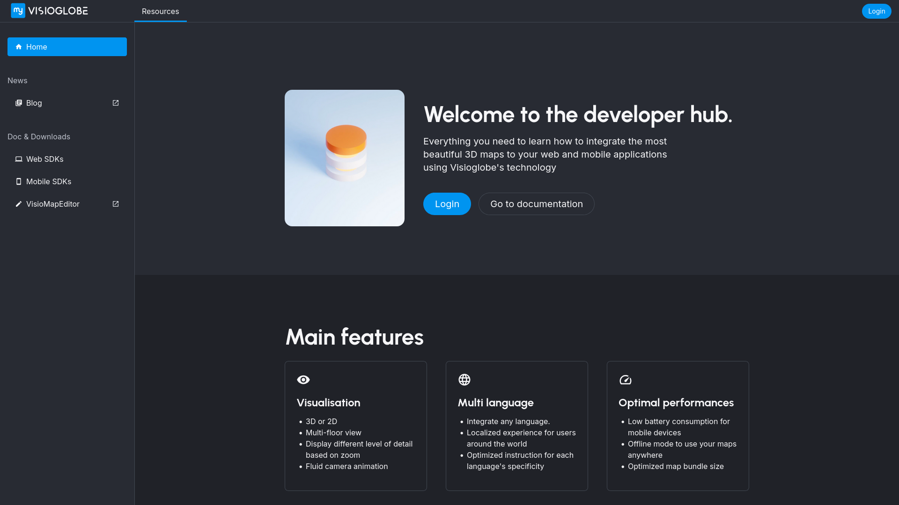
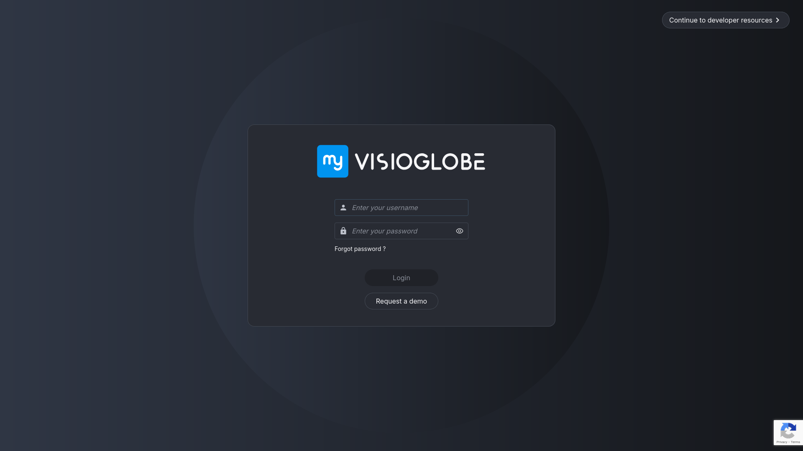

---

# VisioDirectory

Version en Vue 3 terminée à 99%

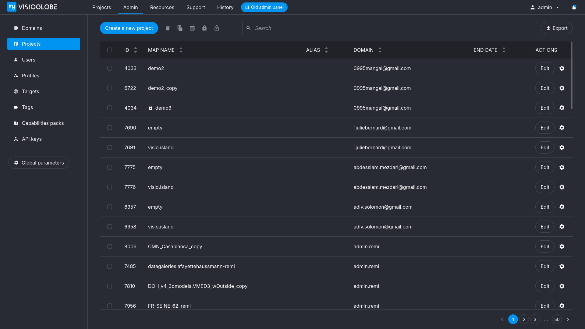

---

# VisioMapEditor

Pas de Vue 3 😞

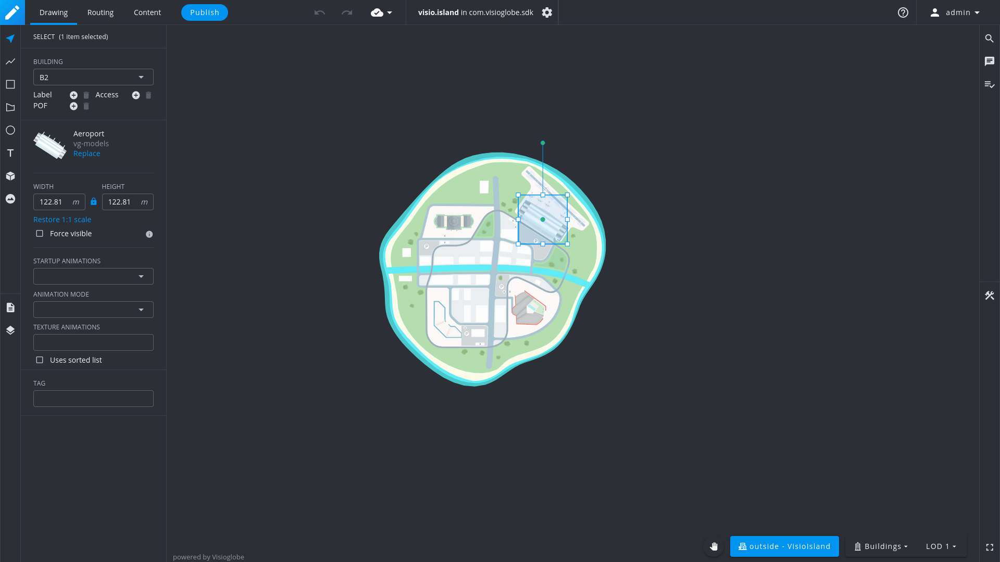

---

# Autres projets importants

- VisioAssets : Transition à Vue 3 débutée
- VisioStats : Toujours en Vue 2

---
layout: section
---

# 2. Structure

---
layout: two-cols-header
transition: fade
---

# assets/vue
::left::
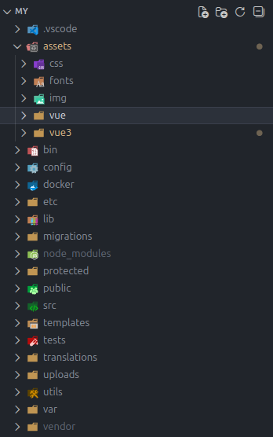
::right::
Contient les fichiers **Vue 2**
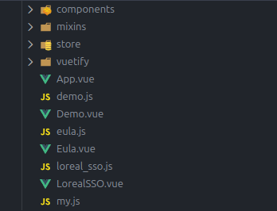

---
layout: two-cols-header
transition: fade
---

# assets/vue3
::left::
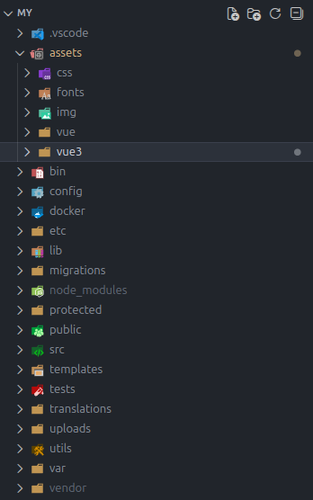
::right::
Contient les fichiers **Vue 3**
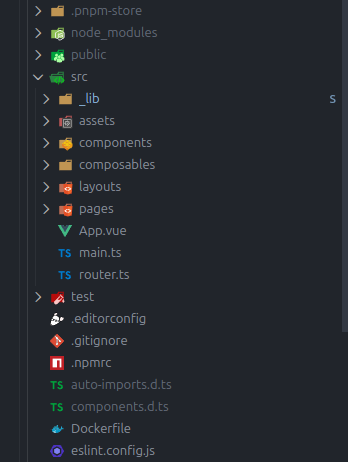

---
layout: two-cols-header
---

# src et templates
::left::
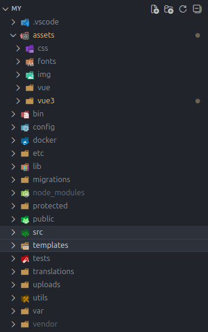
::right::
- src contient les fichiers **PHP**
- templates des fichiers **html** utilisés pour faire le lien entre Vue et PHP

---
layout: section
---

# Projects annexes

---

# lib

Pour certains éléments communs à my et à directory

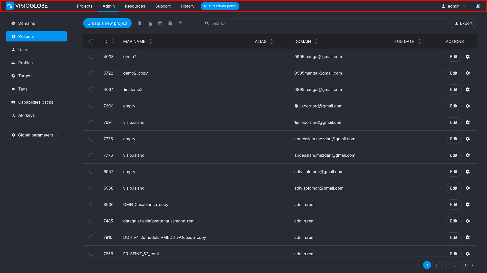

---
transition: fade-out
---

# Visiotify

- Design system sur le Figma de Pierre :

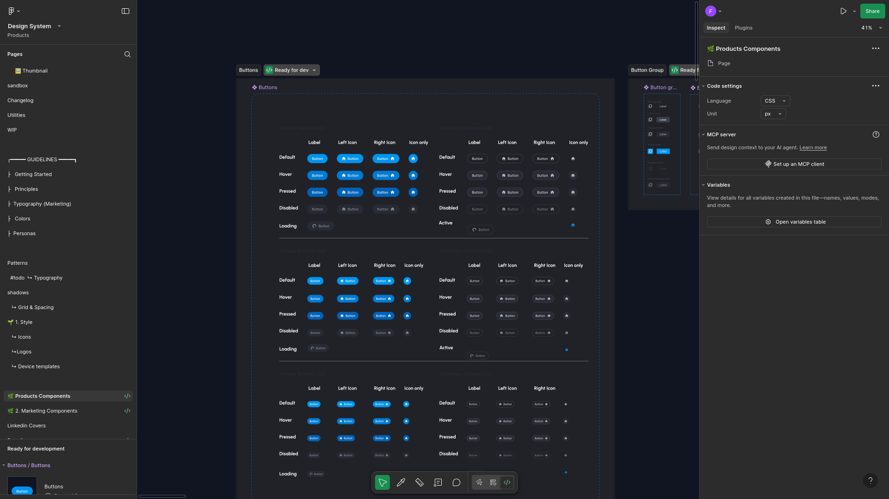

---
transition: fade-out
---

# Visiotify

- Tests basés sur Storybook

```ts {all|3|5-10|15-23}
import type { Meta, StoryObj } from '@storybook/vue3'

import VGButton from '~/components/VGButton.vue'

const meta: Meta<typeof VGButton> = {
  component: VGButton,
  argTypes: {
    default: { control: 'text' },
  },
} satisfies Meta<typeof VGButton>

export default meta
type Story = StoryObj<typeof VGButton>

export const Text: Story = {
}

export const Icon: Story = {
  args: {
    icon: true,
    default: () => h({ template: '<span class="icon-[ic--baseline-biotech]" />' }),
  },
}
```

---

# Visiotify

- Pour avoir le resultat : pnpm run dev

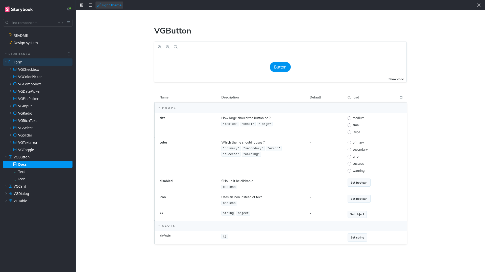

---
layout: statement
---

# Merci et à + dans le bus !

